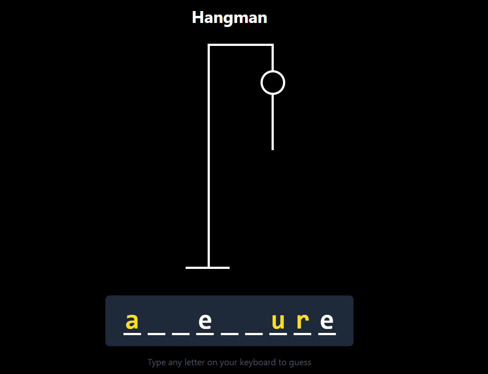
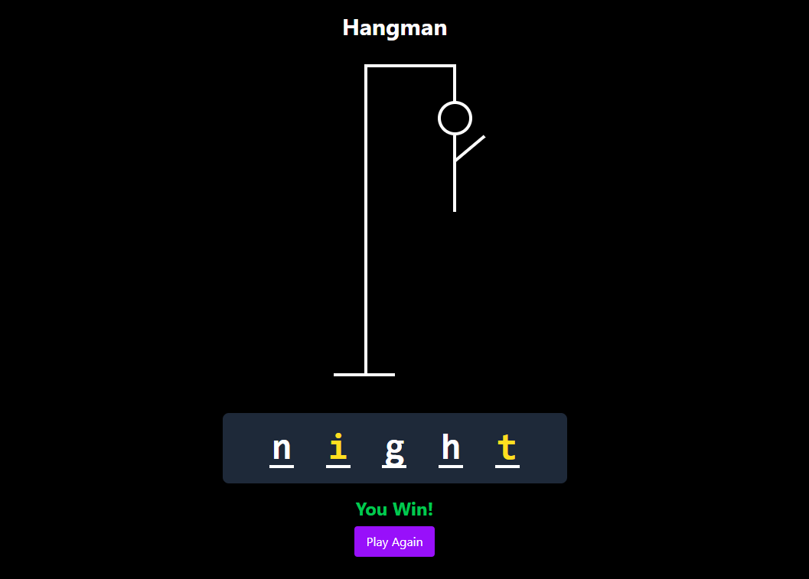
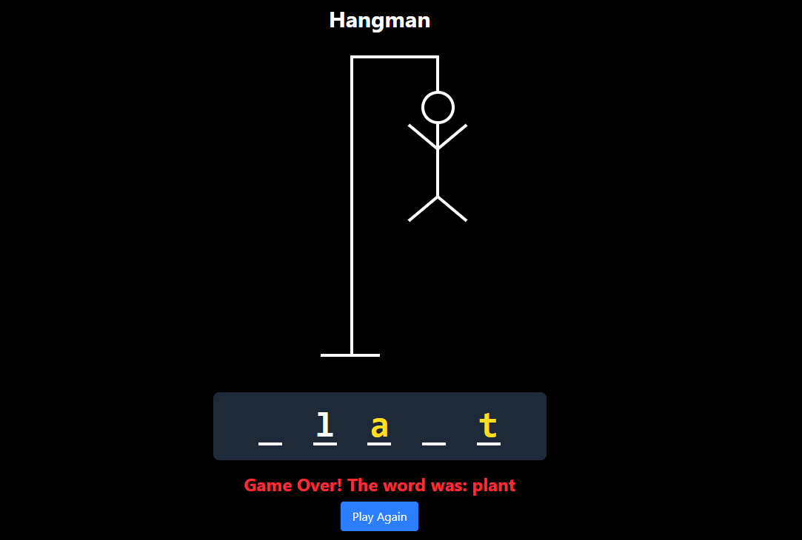

# HANGMAN - word game!👾  (React + TypeScript)

This is a simple Hangman game built with **React** and **TypeScript** as a fun practice project. The classic word-guessing game is implemented with a clean UI and responsive design.

## 🚀 Features

- 🎯 Classic Hangman gameplay
- 🧠 Random word generation
- 💻 Built using React + TypeScript
- 📱 Responsive design
- ✅ Keyboard input support

## 📸 Screenshots

  

  

  

